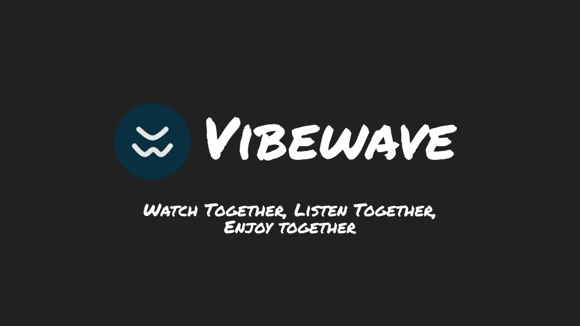

# Vibewave

## _A Group Music & Video Party Platform_

<a href="https://vibewave.herokuapp.com" target="_blank">Visit Vibewave</a>

 

 

---

## About Vibewave

Vibewave is an app where you can listen to and share music & videos with your friends and the broader community in real time.

- Any Vibewave user can create his/her own room where he/she will be the host
- Vibewave users can join any of the rooms available on Vibewave, and listen to the music/video selections played by the host together with other users in real time
- Inside a room, users can also interact with each other through chat, sharing their thoughts, ideas, or just anything they want to talk about.
- Users can also make song/video requests, which will show up on the 'Request Board', from which the host can choose to add to the room's playlist queue

> ### _If you love music and want to enjoy listening with your friends in real time, hop in to Vibewave!_

 

---

 

## Tech Stack

- 
- 
- 
- 
- 
- 
- 
- 
- 

Built with <a href="https://www.npmjs.com/package/nodejs-express-app" target="_blank" >`nodejs-express-app`</a>

 

---

## The Engineers

- <a href="https://github.com/pdl39" target="_blank">
Peter D. Lee

- <a href="https://github.com/TDQ2" target="_blank">
Tao Quan

- <a href="https://github.com/avante-garde" target="_blank">
Jason Nguyen

- <a href="https://github.com/AndyYMoy" target="_blank">
Andy Moy

